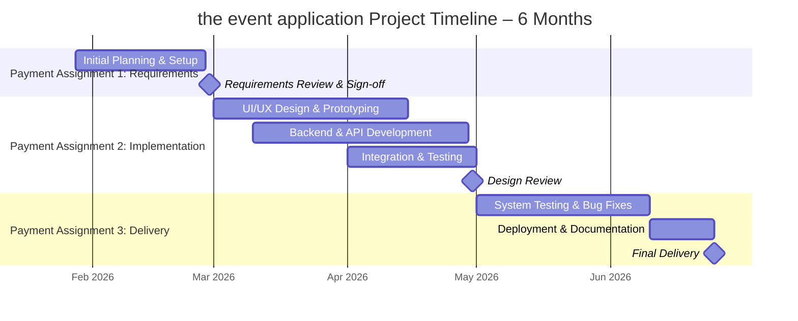

# Assignment #1: Project Management Plan

## Project Manager for "The Event Application" – Event Management & Ticketing Platform

## Project Overview

This repository contains the project management plan for **the event application**, an event management and ticketing application similar to platforms such as Eventbrite. The application allows organizers to create and manage events, sell tickets, track attendance, and analyze event performance.

As the assigned **project manager**, I am overseeing a development team of four additional members while also contributing to coordination and documentation. The purpose of this assignment is to demonstrate structured project planning, skills assessment, and milestone-based delivery rather than full software implementation.

The project runs for six months and includes three payment-linked milestones that must be reviewed and approved before payment is issued to the development team.

---

## Project Scope & Timeline

**Project Name:** The Event Application – Event Management Platform
**Development Team:** Inshal Zahid (Project Manager), Kim Quynh Huong Tuong, Muhammad Hassnain, Raj Bahadur Bhat, Fabio Bustamante Romillo
**Project Duration:** 6 months (January 28 – June 25, 2026)

The project is divided into three major payment assignments:

* **Requirements Review** – Due: February 28, 2026 (Month 1)
* **Implementation & Design Review** – Due: April 30, 2026 (Month 4)
* **Final Delivery** – Due: June 25, 2026 (Month 6)

Each payment is contingent on successful completion and approval of the corresponding milestone.

---

## Skills Assessment

A skills assessment was conducted with the four team members during a 60-minute class session to align responsibilities with individual strengths.

* **Inshal Zahid** – Project Manager & Coordination
  *Skills:* Project planning, requirements analysis, documentation, GitHub Projects, agile methodologies
  *Role:* Oversees project planning, validates requirements, manages milestones, and ensures deliverables meet expectations

* **Kim Quynh Huong Tuong** – Frontend & UI/UX Developer
  *Skills:* HTML, CSS, JavaScript, React, responsive design, Figma
  *Role:* Designs and implements event pages, user flows, and visual layout

* **Muhammad Hassnain** – Backend Developer
  *Skills:* Node.js, Express, REST APIs, database design
  *Role:* Implements backend services for events, ticketing, and user management

* **Raj Bahadur Bhat** – QA & Testing Engineer
  *Skills:* Manual testing, test case design, bug tracking, regression testing
  *Role:* Ensures application quality through systematic testing and validation

* **Fabio Bustamante Romillo** – DevOps & Documentation
  *Skills:* GitHub workflows, CI/CD fundamentals, deployment planning, technical documentation
  *Role:* Manages repository structure, deployment workflows, and documentation

---

## Requirements Review

**Purpose:** To review all software requirements and verify the team has defined everything needed to design the the event application platform.

**Input:** the event application Requirements Document (provided by the development team)

**Key Activities:**

* Review functional requirements: event creation, ticket sales, attendee registration, check-in system
* Review non-functional requirements: scalability, performance during high traffic, security of payment data
* Confirm user roles and stories: event organizers, attendees, administrators
* Validate compliance considerations for payments and personal data handling
* Identify gaps: refund handling, email notification requirements, mobile usability
* Document stakeholder approval before moving into implementation

---

## Project Plan

All tasks are tracked using **GitHub Projects** with the following workflow:
**Backlog → To Do → In Progress → Review → Done**

### GitHub Projects Task Board

* **Backlog**

  * Finalize project scope and objectives (Inshal) – Due 2026-01-30
  * Complete team skills matrix (Inshal) – Due 2026-01-31

* **To Do**

  * Analyze requirements document (Inshal) – Due 2026-02-05
  * Design database schema for events and tickets (Sara) – Due 2026-02-10
  * Create UI wireframes for event pages (Alex) – Due 2026-02-15
  * Setup CI/CD and repository structure (Maya) – Due 2026-02-20

* **In Progress**

  * Requirements validation and gap analysis (Inshal) – Due 2026-02-28

* **Review**

  * Review event creation prototype (Alex & Sara) – Due 2026-04-30
  * Test ticket purchasing flow (John) – Due 2026-05-02
  * Deployment and security review (Maya) – Due 2026-05-05

* **Done**

  * Finalize user and admin documentation (Inshal) – Due 2026-06-20
  * Deliver final platform for evaluation (Inshal) – Due 2026-06-25

Each task includes a description, assignee, due date, labels (e.g., `frontend`, `backend`, `urgent`), and status.

---

## Implementation & Design Review

**Purpose:** To review the system design and initial prototype of the event application and verify that it meets the approved requirements.

**Input:** Design Documentation and Initial Software Release (prototype)

**Key Activities:**

* Review system architecture and API design
* Evaluate prototype functionality: event setup, ticket checkout, attendee management
* Validate integration between frontend and backend components
* Conduct internal usability testing
* Identify improvement areas: checkout speed, mobile layout, analytics features

---

## Final Delivery

**Purpose:** To deliver the final the event application product to the customer (class stakeholders).

**Input:** Final documentation and production-ready software release

**Key Activities:**

* Conduct final system and regression testing (John)
* Deploy production build (Maya)
* Finalize all technical and user documentation (Inshal)
* Prepare final demonstration and presentation (Alex)
* Archive project artifacts and obtain formal acceptance (Inshal)

---

## Project Timeline (Mermaid)

---

## Class Time Utilization

A structured 60-minute class session on January 28th, 2026 was used to:

* Clarify the event application’s core features and MVP scope
* Discuss technical approach and constraints
* Assign roles based on skills assessment
* Establish communication cadence and project tools
* Identify initial risks such as payment security and timeline constraints

---

## Reflection

### Project Quality

the event application is a well-scoped and realistic project that reflects real-world event management platforms. The milestone-based payment structure enforces accountability and structured progress.

### Connection to User Needs

The project directly addresses user needs by simplifying event organization and ticketing. Each phase ensures the right features are built, reviewed, and delivered effectively.

### Difficulty Assessment

Moderately challenging. While event management systems are common, payment handling, scalability, and reliability introduce meaningful complexity. The six-month timeline is achievable with proper coordination.

### Overall

This project effectively combines software planning, team coordination, and quality control. It mirrors professional project management practices and provides valuable experience beyond pure coding.
